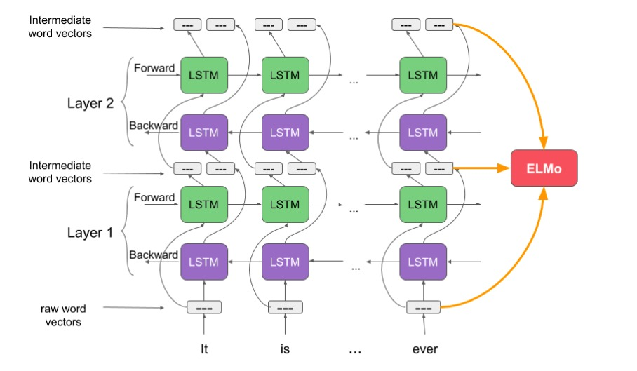
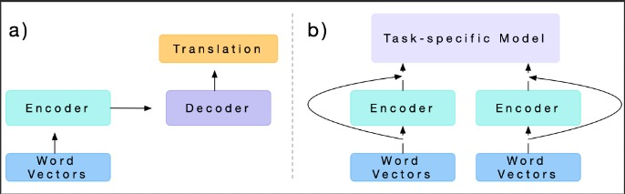
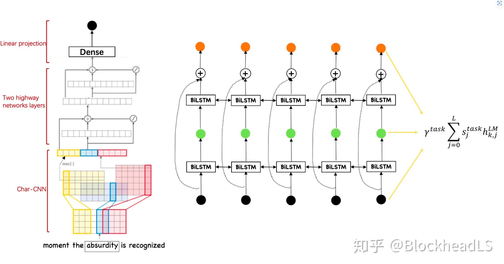
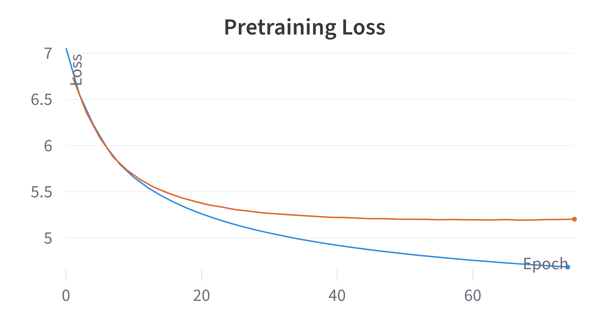

# NLP Assignment 2

**Name:** Shubh Agarwal
**Roll No:** 2020101131

## Theory

### 3.1.1
One of the challenges in natural language processing (NLP) is to obtain word representations that capture the meaning and usage of words in different contexts. Contextualized word embeddings are a type of word vectors that are derived from the surrounding words in a sentence, rather than from a fixed vocabulary. Two techniques for obtaining contextualized word embeddings are ELMo (Embeddings from Language Models) and CoVe (Contextualized Word Vectors). Below, I have provided an explaination for each as well as their similarities and differences.

#### ELMo

ELMo uses a deep (layer = 2) bidirectional language model (2 separate LSTMs) to generate contextualized word embeddings. The idea is that language is not just 'left-to-right'. Instead, language depends on even words/sentences which occur after it. Because of this dependency, just relying on the words to the left of the current word gives us half the information required to make a good prediction. The amount of possibilities would reduce way more if we also consider the words to the right of the current word. This is why ELMo uses a bidirectional language model.

ELMo trains a bidirectional LSTM model on a large text corpus in the same language. ELMo uses different layers of the biLSTM to capture different levels of context. The lower layers usually capture syntactic features, such as part-of-speech tags and word morphology, while the higher layers capture semantic features, such as word sense and topic. This is the advantage of having multiple layers in the LSTM.

ELMo forms a contextualized word embedding for each word by taking a weighted sum of the hidden states from the layers of the biLSTM. The hidden states are the internal representations of the biLSTM at each time step. The weights are learned for each task that ELMo is used for, making ELMo adaptable to various NLP tasks. For example, ELMo can be used for sentiment analysis, named entity recognition, question answering, classification as our current downstream task, etc.. The final contextualized representation is the sum of the linear combination of the hidden states and the word embedding of the word.

#### CoVe

CoVe is another way to obtain contextualized word embeddings. But, CoVe uses a different source: a machine translation model. CoVe leverages the context from a sentence's translation in another language to improve contextual embeddings.

The idea is that to be able to successfully translate one language to the other, we need to know the meaning and context of the sentence as the whole and also for each of the words. So, by employing the machine translation task and training it on it, we can get contextualized word embeddings.

CoVe uses a pre-trained machine translation model to translate sentences from the source language to the target language. For example, CoVe can use an English-to-French translation model to translate English sentences to French. The machine translation model consists of two parts: an encoder and a decoder. The encoder converts the source sentence into a vector representation, while the decoder generates the target sentence from the vector representation.

CoVe employs a bidirectional LSTM as part of its encoder in the machine translation model. This bidirectional LSTM captures context in the source language, similar to ELMo. CoVe then takes the hidden states of the bidirectional LSTM in the encoder and uses them as contextualized word vectors for words in the source language sentences.

### 3.1.2

#### Problem

Pre-trained Word Embeddings will not be able to take into account Out of Vocabulary Words. What we have to do in this case is to usually just give the mean of all the vector representations of Glove/Word2Vec or whatever embeddings we are using. This is not a good solution as it doesn't take into account the context of the word. This is where character level embeddings come in. This would confuse the model and would not be able to give us the best results.

#### Solution

Character level embeddings are a way to obtain word embeddings that are not dependent on the word itself. This is because they work on the character level. The idea is that the character level embeddings will be able to capture the context of the word and will be able to give us a better representation of the word especially for Out of Vocabulary Words.

#### Process

We take the character embeddings and run multiple convolutional layers over them. These convolutions give us the meanings of the 'sub-words'. Finally, they are pooled (usually max-pooled) to give us the main importance of the feature aka meaning. Finally, multiple of these outputs are concatenated to give us the final word embedding.

#### Disadvantage

Getting the meanings from the characters is a difficult process and makes the process considerably more challenging even though it would reduce memory a lot.

#### Alternatives

We can also do 'sub-word' tokenizations, something that is done in the transformer models. 

Subword tokenization methods are based on the idea that uncommon words should be broken down into meaningful subwords rather than frequently used words being divided into smaller subwords. For instance, the word "annoyingly," which may be broken down into the parts "annoying" and "ly," may be rare. The stand-alone subwords "annoying" and "ly" would appear more frequently, while the meaning of "annoyingly" is maintained by the combined meaning of "annoying" and "ly".  Subword tokenization enables the model to acquire meaningful context-independent representations while maintaining a manageable vocabulary size. Additionally, by breaking down words into their constituent subwords, subword tokenization enables the model to process words it has never encountered before.

#### Differences

- Source of context: ELMo uses context from the same language text, while CoVe uses context from a translation model applied to a different language.
- ELMo captures contextual information from the input sentence itself, while CoVe uses context from a translation model applied to a different language. 
- Another difference is that ELMo's contextualized representations are parameterized by learned task-specific weights, allowing them to adapt to various NLP tasks. CoVe doesn't have this adaptability.
- CoVe requires a labelled corpus making it harder to obtain. ELMo doesn't require a labelled corpus. It can be trained on any large text corpus.
- CoVe uses only the final layer to generate the contextualized word embeddings. ELMo uses all the layers to generate the contextualized word embeddings.

## Code

### Hyperparameters

    cfg = {
        'dev_train_len': 25*10**3,
        'dev_validation_len': 5*10**3,
        'learning_rate': 0.001,
        'epochs': 100,
        'embedding_dim': 100,
        'batch_size': 32,
        'dropout': 0.2,
        'optimizer': 'Adam',
        'num_layers': 2,
        'embedding_dim': 100
    }

### Method

#### Data Cleaning

Removed most punctuations/special characters except for `!` and `?`. This is because these are widely used and they have a lot of meaning.

#### Tokenization

I used NLTK's `word_tokenize` to tokenize the sentences.

#### Lemmatization

I used NLTK's `WordNetLemmatizer` to lemmatize the tokens.

The reason I did this is to reduce the vocab size as the vocab size was coming to be around 60,000 words. Moreover, as the downstream task is for classification, the meaning of the word is more important than the word itself. So, lemmatization would help in this case.

#### Removal of Words not present in Glove

I removed all reviews where even one word was not present in the Glove embeddings. This is because the model would not be able to learn anything from the words that are not present in the Glove embeddings. And since there are a lot of reviews, it is not hurting my dataset. I could also have just replaced the words as 'unk' but I went ahead with this approach.

#### Removal of Rare Words

I removed all words that were present less than `4` times in the dataset. This is because the model would not be able to learn anything from these words as they are very rare. Furthermore, it helps reduce my vocabulary size by half.

It is to note that I didn't remove the rare words from my input. But I removed them from my prediction due to the rarity of the words, the model would not be able to learn anything from them.

#### Vocabulary Size

21492

### Pretraining ELMo

I created `2` LSTMs in the ELMo class. One for the `forward` language modelling and one for `backward`.

I trained each of the LSTMs on the dev_train dataset and used dev_validation dataset. I used Early Stopping with a patience of `3` and a delta of `0.001`. I then saved the weights of the best model.

> Pretraining Validation Loss: 5.1930

Validation Loss is in `orange` color while training loss is in `blue` color

### Downstream Task

I then created a classifier that takes the hidden state and cell state output of the forward and backward LSTMs for each layer and concatenates them. I matrix multiply this with a tensor `delta` and sum them up. This is then fed into a linear layer with a softmax activation function.

Here too, I used Early Stopping with a patience of `3` and a delta of `0.001`.

> Downstream Validation Loss: 0.2884

## Bonus: Delta variation

### Trained

**Test Loss**
> 0.2954

**Classification Report**

                precision    recall  f1-score   support

            0     0.9319    0.8893    0.9101      1708
            1     0.9539    0.9722    0.9630      1765
            2     0.8504    0.8130    0.8313      1503
            3     0.8235    0.8837    0.8526      1505

    accuracy                          0.8929      6481
    macro avg     0.8899    0.8896    0.8892      6481
    weighted avg  0.8938    0.8929    0.8929      6481

**Confusion Matrix**

    [
        [1519   41   78   70]
        [  13 1716   24   12]
        [  54   24 1222  203]
        [  44   18  113 1330]
    ]

As we can see, the model is performing well on the downstream task. The model is able to classify the `0` and `1` labels with high precision but doesn't do that well with `2` and `3` labels.

### [3, 0, 0]

**Test Loss**
> 0.3215

**Classification Report**

                precision    recall  f1-score   support

            0     0.9203    0.8653    0.8920      1708
            1     0.9403    0.9734    0.9566      1765
            2     0.8460    0.8150    0.8302      1503
            3     0.8269    0.8791    0.8522      1505

    accuracy                          0.8863      6481
    macro avg     0.8834    0.8832    0.8827      6481
    weighted avg  0.8868    0.8863    0.8860      6481

**Confusion Matrix**

    [
        [1478   66   97   67]
        [  21 1718   13   13]
        [  58   23 1225  197]
        [  49   20  113 1323]
    ]

As we can see, the same trend is continued here. The model performs a little bit worse than the trained delta model. Here, we are just using the `glove` embeddings for the input.

### [1, 2, 3]

**Test Loss**
> 0.2973

**Classification Report**

                precision    recall  f1-score   support

            0     0.9214    0.8993    0.9102      1708
            1     0.9697    0.9598    0.9647      1765
            2     0.8547    0.8257    0.8399      1503
            3     0.8260    0.8864    0.8551      1505

    accuracy                          0.8957      6481
    macro avg     0.8929    0.8928    0.8925      6481
    weighted avg  0.8969    0.8957    0.8960      6481

**Confusion Matrix**

    [
        [1536   27   77   68]
        [  27 1694   20   24]
        [  56   17 1241  189]
        [  48    9  114 1334]
    ]

Here, the model is performing better than the trained delta model. `1` is for the `glove` embeddings, `2` is for the output of the first layer of the LSTMs and `3` is for the output of the second layer of the LSTMs.

### [0, 0, 3]

**Test Loss**
> 0.3090

**Classification Report**

                precision    recall  f1-score   support

            0     0.9145    0.8888    0.9014      1708
            1     0.9535    0.9637    0.9586      1765
            2     0.8118    0.8523    0.8315      1503
            3     0.8615    0.8352    0.8482      1505

    accuracy                          0.8883      6481
    macro avg     0.8853    0.8850    0.8849      6481
    weighted avg  0.8890    0.8883    0.8884      6481

**Confusion Matrix**

    [
        [1518   49   93   48]
        [  21 1701   30   13]
        [  62   19 1281  141]
        [  59   15  174 1257]
    ]

Here, we are just using the final layer of the ELMo LSTM for prediction. As we can see, the model is performing worse than the trained delta model.

### [1, 1, 1]

**Test Loss**
> 0.2945

**Classification Report**

                precision    recall  f1-score   support

            0     0.9171    0.9063    0.9117      1708
            1     0.9649    0.9660    0.9655      1765
            2     0.8515    0.8277    0.8394      1503
            3     0.8415    0.8751    0.8580      1505

    accuracy                          0.8971      6481
    macro avg     0.8937    0.8938    0.8936      6481
    weighted avg  0.8973    0.8971    0.8971      6481

**Confusion Matrix**

    [
        [1548   28   81   51]
        [  25 1705   20   15]
        [  57   20 1244  182]
        [  58   14  116 1317]
    ]

Here, we are giving the same weightage to each of the embeddings. As we can see, the model is performing better than the trained delta model. This is because the model is able to learn from the `glove` embeddings as well as the output of the ELMo LSTM.

## Bonus: Character CNN

    cfg = {
        'dev_train_len': 25*10**3,
        'dev_validation_len': 5*10**3,
        'learning_rate': 0.001,
        'epochs': 100,
        'char_embedding_dim': 32,
        'batch_size': 32,
        'dropout': 0.1,
        'optimizer': 'Adam',
        'num_layers': 2,
        'word_emb_dim': 200,
        'max_word_len': 20,
        'hidden_dim': 100,
        'char_out_channels': 64,
    }

### Method

Data Preparation is the same as the above method.

The difference is that I do not remove Out of Vocabulary words from the corpus as I am not using any pretrained embeddings here. But for the rare words, I remove them here too for the prediction task as the rare words would not be able to help the model learn anything but just increase the vocab size consequently increasing parameter count and computation time.

In the CharCNN model class, I initialize a random character embedding for each character which will be learning during the language modelling.

kernel_sizes=[2, 3, 4, 5, 6]

Apart from that, it is nearly the same as the normal ELMo model.

### Results

**Pretraining Validation Loss**
> 5.4241

**Downstream Validation Loss**
> 0.5128

**Test Loss**
> 0.5309

**Classification Report**

                precision    recall  f1-score   support

            0     0.8253    0.8253    0.8253      1900
            1     0.8318    0.9289    0.8777      1900
            2     0.7963    0.6953    0.7423      1900
            3     0.7275    0.7347    0.7311      1900

    accuracy                          0.7961      7600
    macro avg     0.7952    0.7961    0.7941      7600
    weighted avg  0.7952    0.7961    0.7941      7600

**Confusion Matrix**

    [
        [1568  140   94   98]
        [  64 1765   23   48]
        [ 127   75 1321  377]
        [ 141  142  221 1396]
    ]

#### Analysis

We can see that using the Pretrained Embeddings were a better option in this case. This could be due to the fact that our dataset is small and the number of hidden dimensions and convolutional layers we are using are less.
